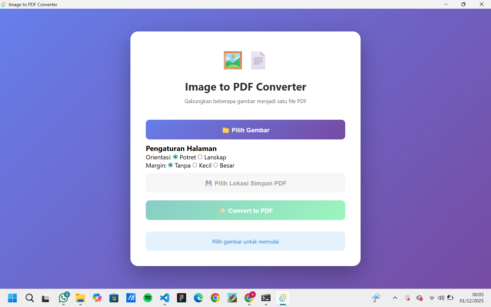
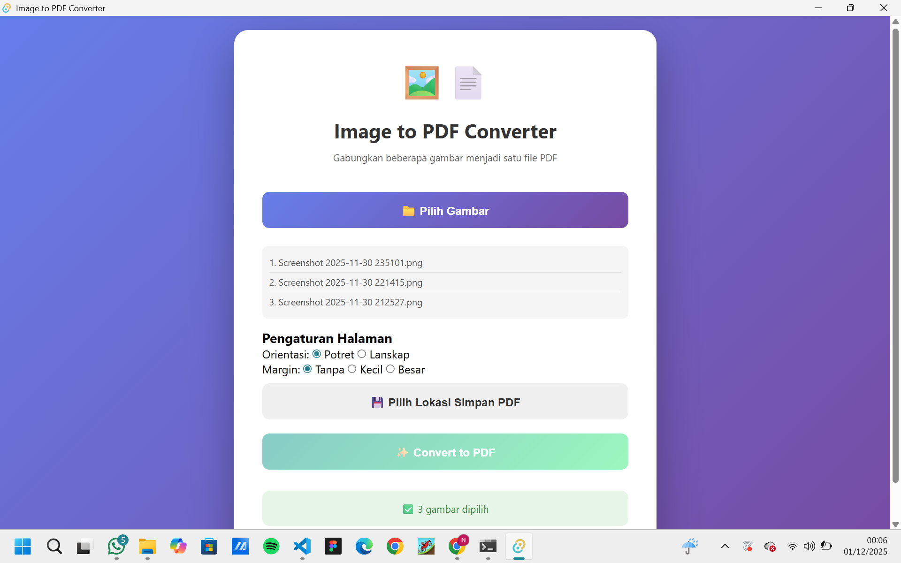
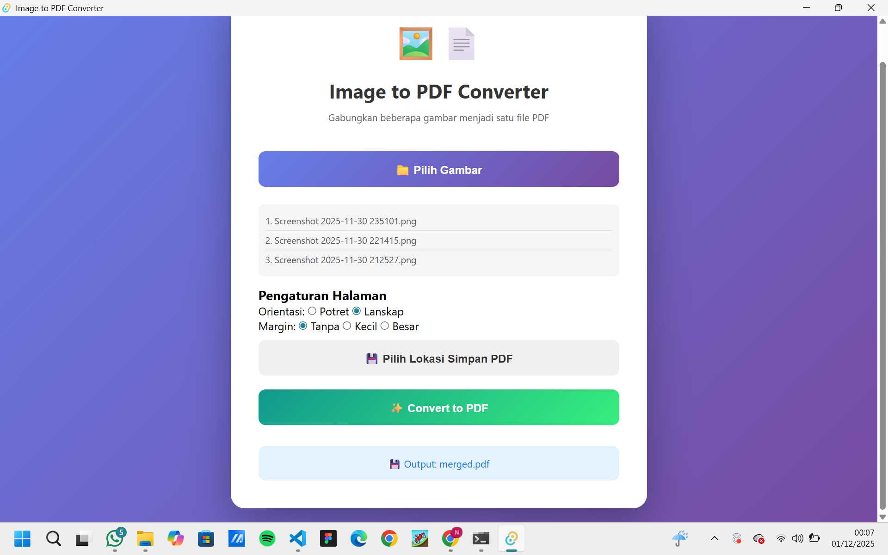
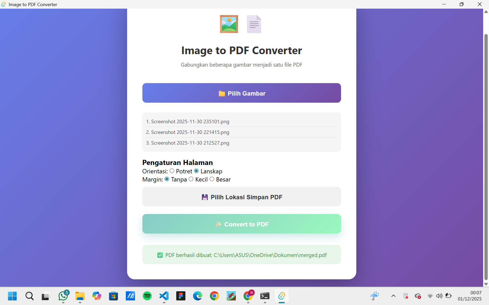
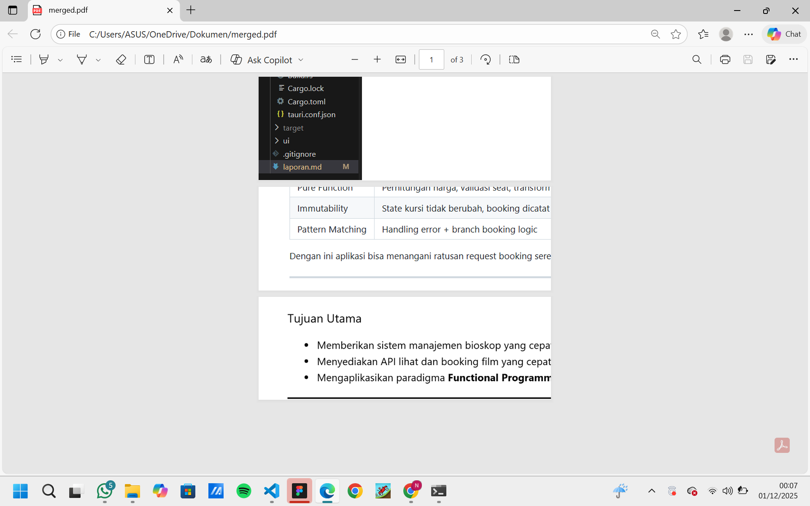

# IMG To PDF

**Authors:** <br/>

Kelompok 7 - Pemrograman Fungsional B <br/>
Abiem Akmal Fadhil, Bayu Raihan Paratama, M. Rizky Kurniadinata, Nabilla Nur Aini, Noel Ericson Rapael Sipayung

---

## Abstract

Proyek IMG To PDF adalah aplikasi desktop yang berfungsi untuk mengonversi satu atau beberapa file gambar (JPEG, PNG, JPG, WEBP) menjadi dokumen PDF dengan cepat dan efisien. Aplikasi ini dibangun menggunakan technology stack Tauri untuk sisi front-end dan Rust untuk sisi back-end. Dengan memanfaatkan sifat Rust yang aman terhadap memori serta paradigma pemrograman fungsional seperti immutability, pure functions, dan pipeline data transformations, aplikasi ini menawarkan solusi ringan, aman, dan multiplatform. Hasil akhirnya adalah aplikasi konversi yang stabil, cepat, dan memiliki konsumsi memori minimal.

---

## Introduction

Aplikasi IMG To PDF dirancang untuk menyelesaikan permasalahan umum yang sering ditemui pengguna ketika ingin mengonversi gambar menjadi dokumen PDF, yaitu:

- Proses konversi yang lambat dan membutuhkan aplikasi berat.
- Ketergantungan pada aplikasi online sehingga kurang aman dan tidak praktis.
- Minimnya aplikasi desktop yang ringan, cepat, dan aman untuk kebutuhan konversi dokumen.

### Mengapa Rust?

| Alasan              | Penjelasan                                                                                                      |
| ------------------- | --------------------------------------------------------------------------------------------------------------- |
| Efisiensi memori    | Rust memastikan keamanan memori tanpa garbage collector, sehingga proses konversi lebih stabil dan minim crash. |
| Performa tinggi     | Cocok untuk memproses banyak gambar serta menghasilkan PDF dengan cepat.                                        |
| Functional friendly | Mendukung paradigma pemrograman fungsional seperti immutability, pure functions, dan iterator pipelines.        |

### Tujuan

- Membangun aplikasi konversi gambar ke PDF yang cepat, aman, dan ringan.
- Memberikan pengalaman konversi offline tanpa bergantung pada layanan internet.
- Mengaplikasikan konsep Functional Programming dalam implementasi proses konversi menggunakan Rust.

---

## Background and Concepts

### Technology Stack

| Komponen         | Teknologi          |
| ---------------- | ------------------ |
| Backend          | Rust + Axum        |
| Desktop Frontend | (HTML/CSS/JS)      |
| Runtime Async    | Tokio              |
| Image Processing | Image (Rust crate) |
| PDF Generator    | Printpdf           |
| Logging          | Tracing            |

### Konsep Pemrograman Fungsional Dalam Sistem

| Konsep PF          | Implementasi Dalam Proyek                                                                                                             |
| ------------------ | ------------------------------------------------------------------------------------------------------------------------------------- |
| Pure Function      | load_image_from_bytes selalu menghasilkan output yang sama untuk input yang sama, transformasi RGBA → raw bytes tanpa efek samping.   |
| Immutability       | Raw image disimpan sebagai Vec<u8> yang bersifat immutable; setiap halaman PDF dibuat sebagai objek baru tanpa mengubah state global. |
| Pattern Matching   | match digunakan untuk error handling (Result), branch logic halaman pertama vs halaman berikutnya.                                    |
| Stateless Process  | Setiap request multipart diproses secara independen tanpa menyimpan state antar request.                                              |
| Explicit Data Flow | Data gambar → konversi → scaling → penempatan → PDF final, tanpa shared mutable data.                                                 |

---

## Source Code and Explanation

### main.rs

**Fungsi:** Entry point aplikasi Tauri yang menjalankan aplikasi desktop.

```RUST
001
002  #![cfg_attr(not(debug_assertions), windows_subsystem = "windows")]
003
004  fn main() {
005    app_lib::run();
006  }
```

**Penjelasan:**

- **Baris 2**: Directive untuk menyembunyikan console window pada build release
- **Baris 4-6**: Fungsi `main()` yang memanggil `app_lib::run()` untuk memulai aplikasi
- **Functional Programming**: Menggunakan **pure function** - `main()` hanya menjalankan satu tugas tanpa side effects

### lib.rs

**Fungsi:** Main library yang mengintegrasikan semua modul dan menyediakan command untuk frontend.

```RUST
001  mod pdf;
002  mod image_utils;
003
004  use std::fs;
005
006  #[tauri::command]
007  async fn convert_images_to_pdf(
008      image_paths: Vec<String>,
009      output_pdf_path: String,
010      orientation: String,   // "portrait" | "landscape"
011      margin: String,        // "none" | "small" | "large"
012  ) -> Result<String, String> {
013      let mut image_data = Vec::new();
014
015      // Load semua gambar
016      for path in &image_paths {
017          let bytes = fs::read(path)
018              .map_err(|e| format!("Failed to read {}: {}", path, e))?;
019
020          let (img_bytes, width, height) = image_utils::load_image_from_bytes(&bytes)
021              .map_err(|e| format!("Failed to load image: {}", e))?;
022          println!("Loaded image: {} ({}x{})", path, width, height);
023          image_data.push((img_bytes, width, height));
024      }
025
026      // Generate PDF dengan opsi orientasi & margin
027      let pdf_bytes = pdf::generate_pdf(image_data, &orientation, &margin)
028          .map_err(|e| format!("Failed to generate PDF: {}", e))?;
029
030      // Simpan ke file
031      fs::write(&output_pdf_path, pdf_bytes)
032          .map_err(|e| format!("Failed to write PDF: {}", e))?;
033
034      Ok(format!("PDF berhasil dibuat: {}", output_pdf_path))
035  }
```

**Penjelasan :**

- **Baris 12**: menggunakan **pattern matching** untuk error handling
- **Baris 17-18**: `.map_err()` adalah **higher-order function** yang mentransformasi error
- **Baris 20-21**: **Pure function** call ke `load_image_from_bytes` - predictable output
- **Baris 27-28**: **Immutable data flow** - `image_data` tidak dimodifikasi setelah dibuat
- **Stateless**: Setiap pemanggilan fungsi independen tanpa shared state

```RUST
036
037  #[cfg_attr(mobile, tauri::mobile_entry_point)]
038  pub fn run() {
039      tauri::Builder::default()
040          .plugin(tauri_plugin_dialog::init())
041          .invoke_handler(tauri::generate_handler![convert_images_to_pdf])
042          .setup(|app| {
043              if cfg!(debug_assertions) {
044                  app.handle().plugin(
045                      tauri_plugin_log::Builder::default()
046                          .level(log::LevelFilter::Info)
047                          .build(),
048                  )?;
049              }
050              Ok(())
051          })
052          .run(tauri::generate_context!())
053          .expect("error while running tauri application");
054  }
```

**Penjelasan :**

- **Baris 39**: **Builder pattern** - functional way untuk konstruksi object complex
- **Baris 40**: **Plugin composition** - menambahkan functionality secara modular
- **Baris 41**: **Handler generation** - menggunakan macro untuk type-safe command binding
- **Baris 42-51**: **Closure/Lambda** dengan conditional logic yang pure
- **Baris 52**: **Method chaining** - functional pipeline untuk app initialization

### pdf.rs

**Fungsi:** Modul untuk generating PDF dari data gambar dengan berbagai opsi kustomisasi.

```RUST
001  use printpdf::*;
002  use std::io::BufWriter;
003
004  use crate::image_utils::image_data_to_dynamic_image;
005
006  pub fn generate_pdf(
007      images: Vec<(Vec<u8>, u32, u32)>,
008      orientation: &str,
009      margin: &str,
010  ) -> Result<Vec<u8>, Box<dyn std::error::Error>> {
011      if images.is_empty() {
012          return Err("no images".into());
013      }
014
015      // Halaman EXACT sama dengan ukuran gambar pertama (1px -> 1mm di sini)
016      let (_first_bytes, first_w, first_h) = &images[0];
017
018      let mut page_w_mm = *first_w as f32 * 0.264583;
019      let mut page_h_mm = *first_h as f32 * 0.264583;
020
021      // orientasi hanya memutar frame, bukan scaling
022      match orientation {
023          "landscape" => {
024              if page_h_mm > page_w_mm {
025                  std::mem::swap(&mut page_w_mm, &mut page_h_mm);
026              }
027          }
028          _ => {
029              if page_w_mm > page_h_mm {
030                  std::mem::swap(&mut page_w_mm, &mut page_h_mm);
031              }
032          }
033      }

**Penjelasan Functional Programming (Bagian 1):**
- **Baris 7**: `Vec<(Vec<u8>, u32, u32)>` adalah **immutable data structure** - tuple untuk menyimpan data gambar
- **Baris 10**: `Result` type untuk **explicit error handling** tanpa exceptions
- **Baris 11-13**: **Early return pattern** - guard clause yang functional
- **Baris 16**: **Destructuring assignment** - mengekstrak data secara deklaratif
- **Baris 22-33**: **Pattern matching** dengan `match` - lebih safe dari if-else chains
034
035      let page_w = Mm(page_w_mm);
036      let page_h = Mm(page_h_mm);
037
038      let (doc, page1, layer1) =
039          PdfDocument::new("Merged Images", page_w, page_h, "Layer 1");
040
041      let mut current_page = doc.get_page(page1);
042      let mut current_layer = current_page.get_layer(layer1);
043
044      for (i, (img_data, width, height)) in images.iter().enumerate() {
045          if i > 0 {
046              let (p, l) = doc.add_page(page_w, page_h, format!("Page {}", i + 1));
047              current_page = doc.get_page(p);
048              current_layer = current_page.get_layer(l);
049          }
050
051          let dyn_image = image_data_to_dynamic_image(img_data, *width, *height);
052          let rgba = dyn_image.to_rgba8();
053          let (w, h) = rgba.dimensions();
054          let raw_rgba = rgba.into_raw();
055
056          let mut raw_rgb = Vec::with_capacity((w * h * 3) as usize);
057          for chunk in raw_rgba.chunks(4) {
058              raw_rgb.push(chunk[0]);
059              raw_rgb.push(chunk[1]);
060              raw_rgb.push(chunk[2]);
061          }
062
063          let image = Image::from(ImageXObject {
064              width: Px(w as usize),
065              height: Px(h as usize),
066              color_space: ColorSpace::Rgb,
067              bits_per_component: ColorBits::Bit8,
068              interpolate: true,
069              image_data: raw_rgb,
070              image_filter: None,
071              clipping_bbox: None,
072          });
073
074          // ukuran gambar
075          let img_w = w as f32;
076          let img_h = h as f32;
077
078          // Tidak ada scaling tambahan: 1px gambar ~ 1mm di PDF
079          let scale = 1.0_f32;
080
081          // Tempatkan di (0,0)
082          let x = 0.0_f32;
083          let y = 0.0_f32;
084
085          println!(
086              "Image {}: {}x{}px, scale {}, x {}, y {}",
087              i + 1,
088              w,
089              h,
090              scale,
091              x,
092              y
093          );
094
095          image.add_to_layer(
096              current_layer.clone(),
097              ImageTransform {
098                  translate_x: Some(Mm(x)),
099                  translate_y: Some(Mm(y)),
100                  scale_x: Some(scale),
101                  scale_y: Some(scale),
102                  rotate: None,
103                  dpi: Some(96.0),
104              },
105          );
106      }
107
108      let mut pdf_bytes = Vec::new();
109      doc.save(&mut BufWriter::new(&mut pdf_bytes))?;
110      Ok(pdf_bytes)
111  }
```

**Penjelasan :**

- **Baris 44**: `.iter().enumerate()` adalah **iterator pipeline** - functional way untuk loop
- **Baris 57**: `.chunks(4)` menggunakan **lazy evaluation** - data diproses on-demand
- **Baris 63-72**: **Immutable struct creation** - sekali dibuat tidak bisa diubah
- **Baris 75-83**: **Immutable bindings** - semua variabel bersifat read-only
- **Baris 95-105**: **Pure transformation** - tidak mengubah state existing object
- **Baris 108-110**: **Explicit data flow** - input → process → output yang jelas

### image_utils.rs

**Fungsi:** Utility functions untuk menghandle operasi image processing dengan pendekatan functional.

```rust
001  use image::DynamicImage;
002
003  /// Load image dari bytes (uploaded file)
004  pub fn load_image_from_bytes(
005      bytes: &[u8],
006  ) -> Result<(Vec<u8>, u32, u32), Box<dyn std::error::Error>> {
007      let img = image::load_from_memory(bytes)?;
008      let rgba = img.to_rgba8();
009      let (width, height) = rgba.dimensions();
010      Ok((rgba.into_raw(), width, height))
011  }
012
013  /// Convert raw image data ke DynamicImage (untuk printpdf)
014  pub fn image_data_to_dynamic_image(data: &[u8], width: u32, height: u32) -> DynamicImage {
015      DynamicImage::ImageRgba8(
016          image::RgbaImage::from_raw(width, height, data.to_vec())
017              .expect("Failed to create image from raw data"),
018      )
019  }
```

**Penjelasan:**

- **Baris 4-6**: **Pure function signature** - untuk input yang sama, selalu menghasilkan output yang sama
- **Baris 6**: `Result` type untuk **explicit error handling** tanpa exceptions
- **Baris 7**: **Function composition** - `image::load_from_memory` dipipe dengan `?` operator
- **Baris 8**: **Immutable transformation** - `img` ditransformasi ke RGBA tanpa mengubah original
- **Baris 9**: **Destructuring** - mengekstrak width dan height secara deklaratif
- **Baris 10**: **Tuple return** - mengembalikan data sebagai immutable tuple
- **Baris 14-19**: **Pure transformation function** - tidak ada side effects, hanya konversi data
- **No shared state** - kedua fungsi bekerja independen tanpa global variables

## Screenshot

### Main Interface



### File Selection



### Conversion Process



### Output Settings



### Generated PDF Result



## Conclusion

Proyek **IMG To PDF** ini berhasil mengimplementasikan aplikasi konversi gambar ke PDF menggunakan paradigma functional programming dengan Rust dan Tauri.

- **Functional Programming**: Menerapkan pure functions, pattern matching, dan stateless processing
- **Performance**: Aplikasi ringan dengan memory safety dan proses konversi yang cepat
- **Features**: Mendukung multiple format gambar, opsi orientasi, dan batch conversion
